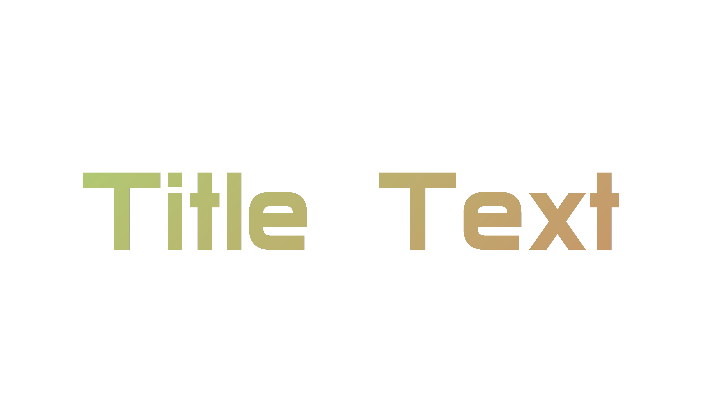

## Title Text

Скрипты для создания принта с текстом. Фон можно использовать любой, либо сгенерировать скриптом.

Just for fun!

RGB https://www.rapidtables.com/web/color/RGB_Color.html

Управляется из файла `config.ini`.

Скрипты работают на базе [Pillow](https://pypi.org/project/Pillow/).

`img_back.py` создаёт бэкграунд. 

`img_text_gen2.py` создаёт изображение с текстом из бэкграунда.

---

Как это работает:

Настраиваем фон в `config.ini`:
```
[img_back]
RES_WIDTH: 7200 - ширина изображения
RES_HEIGHT: 4800 - высота изображения
COLOUR_LEFT: 253, 46, 216 - градиентный цвет слева
COLOUR_RIGHT: 23, 214, 255 - градиентный цвет справа
```

Изображение со шрифтом:
```
[text_gen]
BACKGROUND_COLOUR: 13, 13, 13 - цвет фона изображения
FONT_FILE: data\Archangelsk.ttf - файл шрифта
COEF_FONT_SIZE: 128 - корректировка ширины текста
THE_TEXT: TitleText - текст
RESULT_IMAGE_FILE: result\title_text.png - файл изображения

[common]
BACKGROUND_IMAGE_FILE: data\background_image.png - файл фонового изображения шрифта
```

---

Colours: Git balck: (13, 17, 23) Zero: (0, 0, 0, 0) Google doc black: (27, 27, 27) Google white: (255, 255, 255); 

blue > pink
COLOUR_LEFT: 253, 46, 216
COLOUR_RIGHT: 23, 214, 255

green > red
COLOUR_LEFT: 169, 220, 118
COLOUR_RIGHT: 218, 108, 98

some colours
BLACK, DARKGRAY, GRAY = ((0,0,0), (63,63,63), (127,127,127))
LIGHTGRAY, WHITE = ((191,191,191), (255,255,255))
BLUE, GREEN, RED = ((0, 0, 255), (0, 255, 0), (255, 0, 0))

Resolution: 2K 2560,1440 ; FHD 1920,1080 ; VK обложка 2х 3840,1536; | 4k 3840 x 2160 | 7200 4800