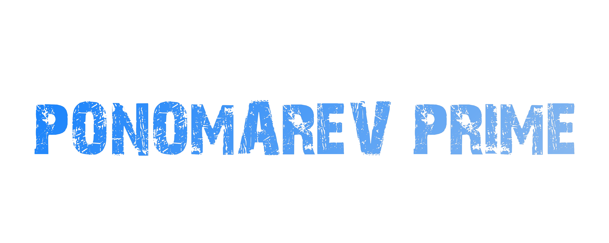
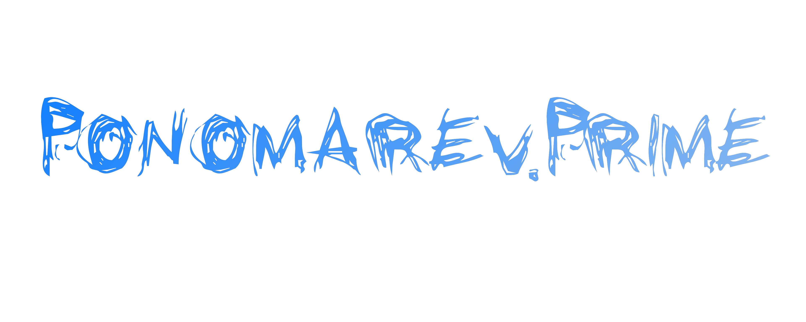
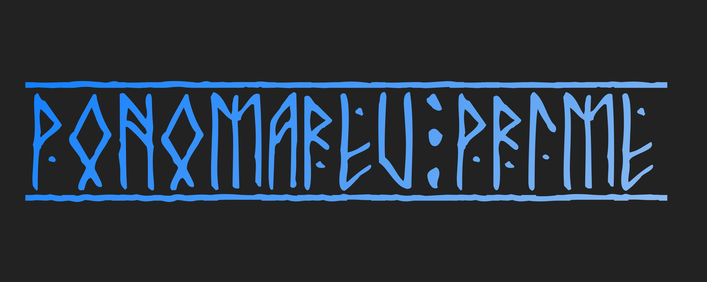
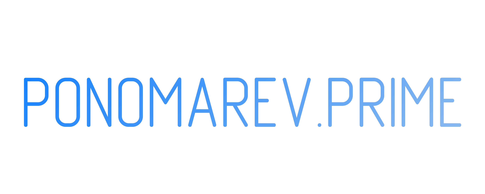

## Title Text

Скрипт для создания принта с текстом. Фон можно использовать любой, либо сгенерировать скриптом.

Just for fun!

RGB https://www.rapidtables.com/web/color/RGB_Color.html

Управляется из файла `config.ini`.

Скрипты работают на базе [Pillow](https://pypi.org/project/Pillow/).

`app_print_maker.py` скрипт творящий волшебство.

---

Как это работает:

Настраиваем всё в `config.ini`:

```
[backgrounder]
RES_WIDTH: 1080 - разрешение
RES_HEIGHT: 1920
COLOUR_LEFT: 169, 220, 118 - градиент
COLOUR_RIGHT: 218, 108, 98 
BACKGROUND_IMAGE_GEN: data\app_background_image.png - сгенерированный фон

[printer]
BACKGROUND_COLOUR: 0 - фон бека для выходного изображения
FONT_FILE: data\fonts\Montserrat-Black.ttf - шрифт
COEF_FONT_SIZE: 64 - коеф. растяжения (для широких форматов)
THE_TEXT: 75,2 - текст
RESULT_IMAGE_FILE: result\app_title_text.png - выходной файл изображения
BACKGROUND_IMAGE_READ: data\x.png - можно нстроить таким же как и BACKGROUND_IMAGE_GEN для удобсва
```
## Цвета

### Фон
Colours: Git balck: `(13, 17, 23)` Zero: `(0, 0, 0, 0)` Google doc black: `(27, 27, 27)` Google white: `(255, 255, 255)`; 


BLACK, DARKGRAY, GRAY = `((0,0,0), (63,63,63), (127,127,127))`
LIGHTGRAY, WHITE = `((191,191,191), (255,255,255))`
BLUE, GREEN, RED =` ((0, 0, 255), (0, 255, 0), (255, 0, 0))`

Notion dark background: 25, 25, 25

YouTube dark: BACKGROUND_COLOUR: 15, 15, 15
### Гадиент

blue > pink
```
COLOUR_LEFT: 253, 46, 216
COLOUR_RIGHT: 23, 214, 255
```

green > red
```
COLOUR_LEFT: 169, 220, 118
COLOUR_RIGHT: 218, 108, 98
```

greem > blue
```
COLOUR_LEFT: 50, 212, 173
COLOUR_RIGHT: 0, 99, 169
```

peqood (mgs v)
```
COLOUR_LEFT: 65, 58, 44
COLOUR_RIGHT: 64, 109, 126
```

uptrader
```
COLOUR_LEFT: 50, 212, 173
COLOUR_RIGHT: 0, 99, 169
```

mysql
```
COLOUR_LEFT: 0, 125, 125
COLOUR_RIGHT: 233, 113, 0
```

A-contract
```
COLOUR_LEFT: 0, 150, 57
COLOUR_RIGHT: 0, 43, 127
```

ZM
```
COLOUR_LEFT: 7, 149, 247
COLOUR_RIGHT: 255, 149, 0
```

beget
```
COLOUR_LEFT: 1, 121, 205
COLOUR_RIGHT: 62, 209, 40
```

VK
```
COLOUR_LEFT: 0, 119, 255
COLOUR_RIGHT: 225, 227, 230

BACKGROUND_COLOUR: 34, 34, 34

RES_WIDTH: 3840
RES_HEIGHT: 1536
```

TradingView
```
COLOUR_LEFT: 223, 26, 121
COLOUR_RIGHT: 255, 105, 3

BACKGROUND_COLOUR: 0, 0, 0
```

### Разрешения 
2K 2560 x 1440 | FHD 1920 x 1080 | 4k 3840 x 2160 | 
VK обложка 2х 3840 x 1536 | Insta 1080 x 1920 | YT x2 banner 4096 x 2304

## Описание

Скрипт который создает изображение с градиентным фоном и наносит текст на это изображение. Программа использует библиотеки `configparser`, `random`, `PIL` (Python Imaging Library) для работы с изображениями.

## Шрифты

https://fonts.mega8.ru/

## Примеры
`data\fonts\28 Days Later Cyr Regular.ttf`

`data\fonts\Grunge Regular.ttf`

`data\fonts\Runic Regular.ttf`

`data\fonts\StarcraftNormal.ttf`

`data\fonts\terminatorcyr_semi_expandedbold.ttf`

`data\fonts\GOST type A Standard.ttf`



# Поправить слеши в `app_config.ini`

Меняем с `\` на `/`
```
sed -i 's/\\/\//g' app_config.ini 
```

## query

```txt
curl -s "localhost:8000/titlegen?the_text=PONOMAREV.PRIME&background_colour=0"
```